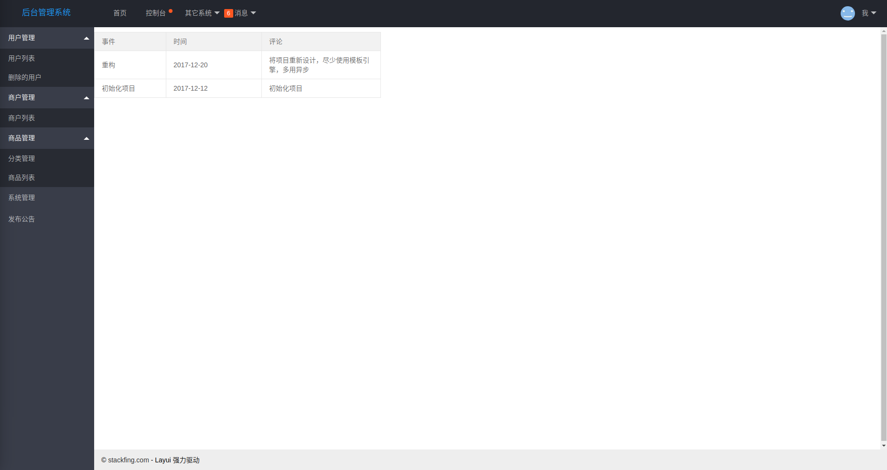
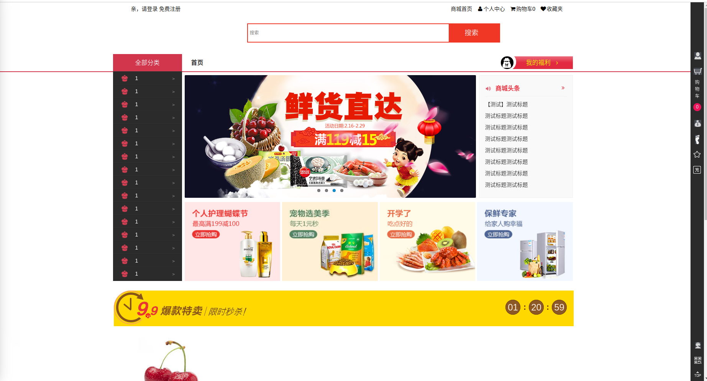

## 简介

基于 Spring Boot，前后端分离的一个购物商城项目

### 【项目施工中...欢迎 star】

#### 后台截图

#### 首页

### 本地开发运行部署

环境准备：

* nodejs、npm、idea、mysql

* 下载 zip 直接解压或安装 git 后执行克隆命令 `git@github.com:imfing/handgo.git`

* 其他系统

    * 在 MySQL 中创建数据库 `handgo`

    * 导入项目至 IDEA，将工程中的 `handgo.sql`导入 MySQL

    * 运行各个系统

* 后台管理系统

    * 进入后台管理系统目录在命令行中输入 `npm run dev` 运行。地址为:http://localhost:8080

### 开发进度

<table>
        <tr>
            <th>系统</th>
            <th>模块名称</th>
            <th>地址</th>
            <th>开发状态</th>
        </tr>
        <tr>
            <th>前台首页系统</th>
            <th>handgo-front</th>
            <th>http://localhost:8889</th>
            <th>60%</th>
        </tr>
        <tr>
            <th>后台超级管理员系统</th>
            <th>handgo-admin</th>
            <th>http://localhost:8888</th>
            <th>30%</th>
        </tr>
        <tr>
            <th>个人中心系统</th>
            <th>handgo-home</th>
            <th>http://localhost:8893</th>
            <th>10%</th>
        </tr>
        <tr>
            <th>单点登录系统</th>
            <th>handgo-sso</th>
            <th>http://localhost:8892</th>
            <th>80%</th>
        </tr>
        <tr>
            <th>活动系统</th>
            <th>\</th>
            <th>\</th>
            <th>未开发</th>
        </tr>
        <tr>
            <th>商家管理系统</th>
            <th>\</th>
            <th>\</th>
            <th>未开发</th>
        </tr>
        <tr>
            <th>订单管理系统</th>
            <th>\</th>
            <th>\</th>
            <th>未开发</th>
        </tr>
    </table>

### 技术一览表

* Spring 全家桶

* MySQL

* Freemarker

* Vue 全家桶

* Element
